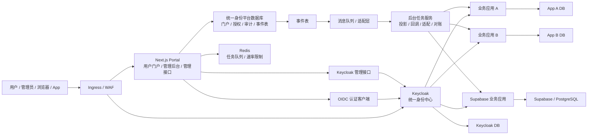

# 统一身份平台整体设计

## 1. 背景与目标

本方案面向多业务系统共存场景，建设一套统一身份平台。平台统一承接用户注册、登录、账号管理、注册审批、应用准入、应用角色分配和管理后台能力，同时允许各业务系统保留自己的业务权限模型、数据库和技术栈。

当前已有核心业务应用使用 Supabase / PostgreSQL 作为数据存储。后续接入的业务应用可能使用 PostgreSQL、KingbaseES、达梦数据库、MySQL、Oracle、SQL Server 或其他数据库。统一身份平台需要支持异构系统接入。

目标态是：Keycloak 作为统一身份中心，Next.js 作为统一门户和管理后台，统一身份平台数据库保存平台侧授权事实，事件表、消息队列和后台任务服务负责跨系统同步。

## 2. 核心业务流程

统一身份平台首先要支撑一条清晰的用户开通链路：用户提交注册申请后，平台记录申请并进入审批；管理员审批通过后开通账号，再为用户分配可访问的应用，以及用户在应用中的角色；平台随后把这些授权事实同步到 Keycloak 和相关业务应用。

注册审批、应用准入和应用角色分配是三个独立环节：

| 环节 | 说明 |
|---|---|
| 注册审批 | 决定是否允许该用户成为平台用户 |
| 应用准入 | 决定该用户可以进入哪些业务应用 |
| 应用角色分配 | 决定该用户在某个业务应用中是什么角色 |

用户注册默认需要管理员审批。平台可以按部署配置启用免审批模式，但免审批只表示注册申请自动通过，不表示用户自动获得任何业务应用访问权限。

默认开通流程：

```text
用户提交注册
  -> 平台记录注册申请
  -> 管理员审核通过或拒绝
  -> 审核通过后创建或启用账号，并写入平台用户总表
  -> 管理员分配应用准入
  -> 管理员分配应用角色
  -> 平台同步到 Keycloak 和业务应用
```

用户只有完成账号审批，并被分配对应应用准入后，才可以进入业务应用。用户在应用中能做什么，由平台分配的应用角色和业务应用内部权限共同决定。

更详细的注册审批、账号开通、应用准入和应用角色分配流程见 [用户门户与管理后台技术设计](../02-user-portal-admin-architecture/) 和 [API 设计](../../02-application/02-api-design/)。

## 3. 核心原则

### 3.1 权限边界

Keycloak 负责集中身份认证、账号生命周期、多因素认证、单点登录、令牌签发和认证侧应用准入标记。

统一身份平台管理跨应用共享授权事实，包括应用目录、应用准入、用户在各应用中的角色分配、平台组织、组织映射、可选租户边界和管理后台权限。

业务应用继续维护角色对应的具体权限，并在本系统内执行资源权限、数据访问控制和业务审计。平台管理“谁在某个应用中是什么角色”，业务应用管理“这个角色在本系统里能做什么”。

### 3.2 应用开发

统一用户门户和管理后台采用 Next.js 前后端一体架构。Next.js 同时承载页面、管理接口和服务端编排逻辑。

前端遵循统一 design system，保证门户、管理后台和高风险操作界面的视觉、交互、组件和状态表达一致。

### 3.3 兼容性

统一身份平台数据库默认使用 PostgreSQL，并要求 schema、migration、查询和数据访问层兼容 KingbaseES PostgreSQL 兼容模式。业务应用数据库保持自治。

消息队列常规部署优先 RabbitMQ 高可用队列，并通过适配层隔离具体产品，便于在国产化或信创部署中替换为组织清单中的中间件。

## 4. 非目标

本设计不做以下事情：

- 不替代 Keycloak 的密码认证、多因素认证、令牌签发、单点登录和外部身份提供方集成能力。
- 不把所有业务应用的细粒度权限塞进 Keycloak 角色、用户组或令牌声明。
- 不直接管理所有业务数据库中的用户、角色、权限和资源表。
- 不要求所有业务系统使用 Supabase、PostgreSQL、KingbaseES 或同一套物理表结构。
- 不在总体设计中展开完整 DDL、OpenAPI、页面原型、测试用例和上线 runbook。

## 5. 总体架构



核心层级：

| 层级 | 组件 | 职责 |
|---|---|---|
| 入口层 | Ingress / WAF | HTTPS、反向代理、基础防护、流量入口 |
| 身份层 | Keycloak | 认证、账号、多因素认证、单点登录、令牌、应用接入配置 |
| 门户层 | Next.js Portal | 用户门户、管理后台、管理接口、服务端权限校验 |
| 平台授权层 | 平台权限中心 | 应用目录、应用准入、应用角色分配、平台组织、组织映射、管理后台权限 |
| 同步层 | 事件表、消息队列、后台任务服务、回调通知、业务适配器 | 事件发布、投影、重试、死信、对账 |
| 业务层 | 各业务应用 | 业务数据、业务权限、本地用户映射、业务审计 |

## 6. 核心组件职责

| 组件 | 职责 |
|---|---|
| Keycloak | 统一身份源，负责账号、登录、MFA、SSO、外部身份源、OIDC/SAML、业务应用 Client 配置和认证侧准入标记 |
| Next.js Portal | 统一门户和管理后台，负责用户入口、账号中心、管理后台 UI、管理接口、服务端权限校验和管理编排 |
| 平台权限中心 | 平台授权事实源，负责应用准入、应用角色分配、平台组织、组织映射、可选租户边界、管理后台权限和投影状态 |
| 后台任务服务 | 负责事件派发、Keycloak 投影、业务应用回调、业务适配、重试、死信和对账 |
| 业务应用 | 负责业务数据、本地用户映射、角色权限定义、资源权限、数据访问控制和业务审计 |

平台权限中心以 Next.js Portal 内的服务端逻辑模块交付，初期随 Portal 一起以 Docker 容器运行。业务角色权限、组织内部数据权限和团队管理规则仍由业务应用自治。

## 7. 身份与权限边界

跨系统统一身份键使用 Keycloak token 中的 `sub`，平台侧字段命名为 `keycloak_sub`。不要使用 email 作为跨系统唯一身份标识。

平台侧总用户表是 `portal_users`。所有被统一身份平台管理的用户都在 `portal_users` 中有一条记录，包括只使用业务应用的用户、可以进入管理后台的用户，以及同时具备两类身份的用户。`portal_users` 不保存密码，也不作为认证源。

权限边界按四个问题划分：

| 问题 | 负责方 | 说明 |
|---|---|---|
| 用户能不能登录？ | Keycloak | 校验账号、密码、多因素认证、单点登录和账号状态 |
| 用户能不能进入某个业务应用？ | 平台权限中心 + Keycloak | 平台保存应用准入事实，并同步到 Keycloak 作为认证侧准入标记 |
| 用户在该应用中是什么角色？ | 平台权限中心 | 例如产品碳足迹数据库系统管理员、数据审核员、数据编辑人员 |
| 这个角色具体能做什么？ | 业务应用 | 例如编辑、审核、团队管理、数据范围控制 |

用户、组织、团队、租户、应用角色、管理后台权限和角色作用范围的详细模型见 [用户与权限模型设计](../04-user-permission-model/)。

应用目录（哪些业务应用被接入、每个应用的准入角色和可分配业务角色）以声明式 YAML（`config/business-apps.yaml`）为唯一真源，通过应用目录服务 apply 到统一身份平台数据库，再将其中的 Keycloak 准入角色投影到 Keycloak；业务角色仍按 §8 所述经 Webhook 交付给业务应用，不在 Keycloak 中建角色。详细结构见 [项目结构设计](../../02-application/04-project-structure-design/) §4.10。

## 8. 同步与一致性

同步原则：

```text
Keycloak 是身份源
统一身份平台数据库是平台授权事实源
业务系统是角色权限定义和业务权限执行源
```

平台事实变更先写入统一身份平台数据库中的事件表，再由消息队列、后台任务服务、回调通知、业务系统适配器和对账任务完成投影。

用户禁用和应用准入撤销属于高风险操作，必须以关键执行点成功为完成标准：

- 用户禁用：Keycloak disable 成功才算关键完成。
- 应用准入撤销：Keycloak 中对应应用准入标记移除成功才算关键完成。

普通授权、用户资料和业务应用投影允许最终一致，但必须有重试、死信、告警和定期对账兜底。详细事件契约、回调通知签名、重试、死信和对账设计见 [同步与事件设计](../../02-application/03-sync-event-design/)。

## 9. 数据库与存储选择

统一身份平台数据库是 Next.js Portal 和平台权限中心使用的业务数据库，用于保存门户数据、平台授权数据、审计日志和事件表。Keycloak 和各业务应用使用各自的数据存储边界。

| 存储 | 选择 | 说明 |
|---|---|---|
| 统一身份平台数据库 | PostgreSQL / KingbaseES 兼容模式 | 保存门户、授权、审计和事件表数据 |
| Keycloak DB | 按 Keycloak 部署要求决定 | 与统一身份平台数据库逻辑隔离，平台服务不直接读写 Keycloak 内部表 |
| Redis | BullMQ 任务队列、定时任务、速率限制 | 不保存持久化业务事实 |
| 消息队列 | RabbitMQ 高可用队列 + 消息队列适配层 | 常规部署优先 RabbitMQ，保留国产消息队列替换空间 |
| 业务系统数据库 | 业务应用自治 | 平台只要求业务应用能建立 `keycloak_sub` 与本地用户的映射 |

更完整的部署、监控、备份和 Redis 持久化策略见 [部署与运维设计](../../03-governance/02-deployment-operations-design/)。

## 10. Supabase 应用边界

Supabase 是接入统一身份平台的业务应用之一，不是总用户中心。统一身份平台仍以 Keycloak 作为统一身份中心。

Supabase 应用内部可以继续使用 Supabase 认证、Supabase 数据库、行级安全策略、本地组织、角色和权限表。统一身份平台只定义与 Supabase 应用的身份、准入、组织映射和事件同步边界。

## 11. 技术栈选择

| 模块 | 推荐技术 | 说明 |
|---|---|---|
| 身份中心 | Keycloak | OIDC、SAML、多因素认证、LDAP/AD、第三方身份提供方 |
| 前后端框架 | Next.js App Router | 门户 UI、管理后台、管理接口和服务端编排 |
| 认证集成 | Auth.js Keycloak Provider / openid-client | 标准 OIDC 接入 Keycloak |
| UI | React + Tailwind CSS / shadcn/ui | 遵循统一 design system |
| 服务端接口与编排 | Next.js 服务端能力 | 管理接口、服务端权限校验和后台编排 |
| 前端数据与表单 | TanStack Query + React Hook Form + Zod | 服务端状态、表单和校验 |
| 数据访问 | Drizzle ORM | TypeScript 类型安全，接近 SQL，兼容性较好 |
| 平台数据库 | PostgreSQL / KingbaseES 兼容模式 | 平台事实、授权、审计、事件表 |
| 内部任务队列 | BullMQ + Redis | 定时任务、重试、并发控制、后台任务调度 |
| 事件分发 | RabbitMQ 高可用队列 + 消息队列适配层 | 常规部署优先 RabbitMQ，保留替换空间 |
| 回调通知 | HMAC-SHA256 签名 | 外部业务系统通知通道，防伪造和重放 |
| 部署 | Node.js Runtime + Docker | 当前阶段以 Docker 部署为主 |

## 12. 安全与运维原则

安全原则：

- 密钥、服务账号令牌、数据库连接串和 Supabase 服务端密钥禁止进入浏览器。
- 所有后端接口必须校验登录态、token、角色和服务端权限。
- 管理后台权限必须由服务端校验，前端隐藏按钮只作体验优化。
- 高风险操作需要二次确认、近期认证或多因素认证，并写审计。

运维原则：

- 当前阶段所有平台侧服务统一采用 Docker 部署。
- Next.js Portal、Keycloak、Redis、RabbitMQ 和可选后台任务服务均以容器运行。
- 数据库可以使用 Docker 部署，也可以按环境要求使用外部数据库服务。
- Keycloak DB、统一身份平台数据库、消息队列、Redis 都需要监控、备份和恢复演练。

详细安全控制见 [安全设计](../../03-governance/01-security-design/)，部署运维见 [部署与运维设计](../../03-governance/02-deployment-operations-design/)。

## 13. 参考文档

- [用户门户与管理后台技术设计](../02-user-portal-admin-architecture/)
- [身份认证与会话设计](../03-auth-session-design/)
- [用户与权限模型设计](../04-user-permission-model/)
- [Keycloak 配置设计](../05-keycloak-configuration-design/)
- [API 设计](../../02-application/02-api-design/)
- [同步与事件设计](../../02-application/03-sync-event-design/)
- [项目结构设计](../../02-application/04-project-structure-design/)
- [安全设计](../../03-governance/01-security-design/)
- [部署与运维设计](../../03-governance/02-deployment-operations-design/)
- [迁移与接入指南](../../03-governance/03-migration-onboarding-guide/)
