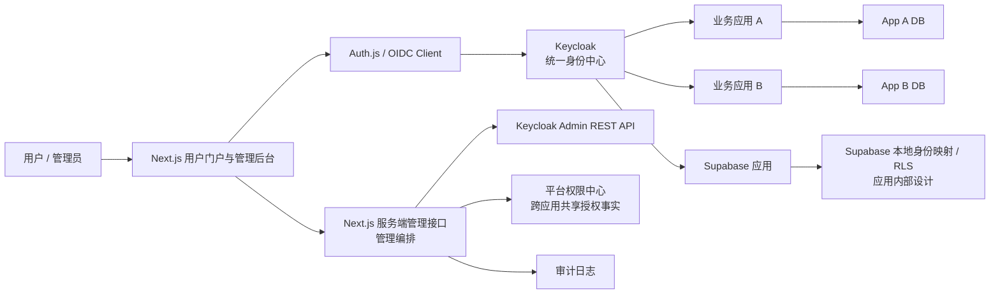
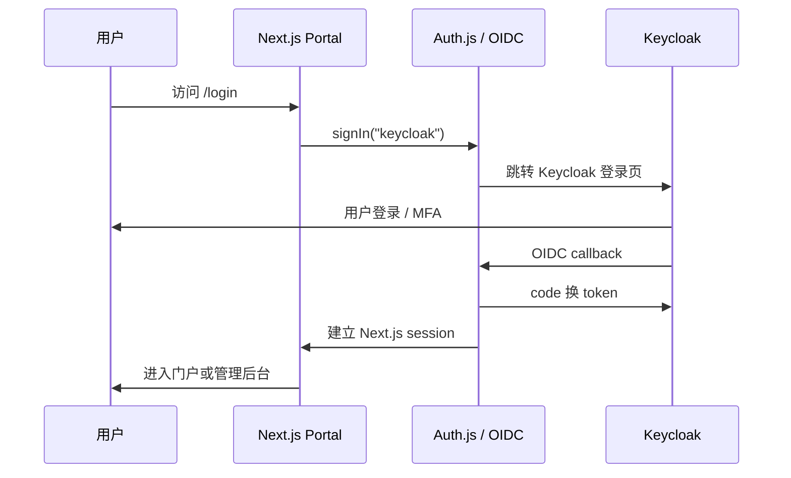
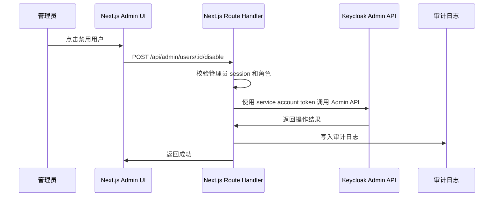
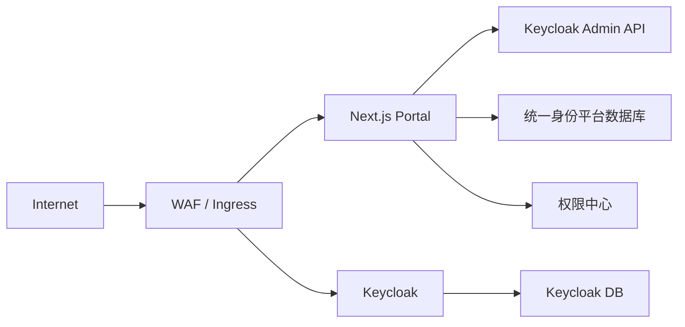

# Keycloak + Next.js 统一用户注册/登录与管理后台技术架构

## 1. 背景

系统需要建设一个统一的用户注册、登录入口和管理后台，用于支撑多个业务应用接入统一身份认证。

现有总体方向是：

- Keycloak 作为统一身份中心。
- 多个业务应用作为 Keycloak Client 接入。
- 各业务系统保留自己的业务权限模型。
- Supabase 只是其中一个业务应用，不是所有系统的总用户中心。

本设计在此基础上增加一个统一门户：

```text
Next.js 用户门户 / 管理后台
```

它负责提供统一 UI、后台管理操作、用户生命周期编排、平台权限中心管理入口和审计展示。

## 2. 目标

### 2.1 业务目标

- 提供统一登录入口。
- 提供统一注册入口。
- 提供用户自助能力，例如资料查看、密码修改入口、MFA 设置入口。
- 提供管理员后台，用于用户、平台组织、应用准入、管理后台角色和权限管理。
- 为多个业务系统提供统一身份管理能力。
- 支持接入企业 SSO、LDAP、AD、第三方 IdP。

### 2.2 技术目标

- 认证核心由 Keycloak 承担。
- Next.js 只做门户 UI、服务端管理接口和管理编排，不存储用户密码。
- 管理后台通过服务端调用 Keycloak Admin REST API。
- 管理后台权限必须服务端校验。
- 业务权限不强行塞进 Keycloak，业务应用维护角色权限定义和业务权限执行。
- 平台权限中心维护跨应用共享授权事实和应用角色分配。
- 用户跨系统主身份使用 Keycloak `sub`，不使用 email 作为主键。

## 3. 非目标

本系统不负责：

- 替代 Keycloak 的密码认证能力。
- 自己实现 OAuth/OIDC 协议。
- 将所有业务应用的细粒度权限集中塞进 Keycloak。
- 直接管理所有业务数据库中的业务用户表。
- 绕过各业务系统自己的授权判断。

## 4. 总体架构



架构分层：

| 层级 | 组件 | 职责 |
|---|---|---|
| 身份层 | Keycloak | 认证、注册、MFA、Token、账号生命周期 |
| 门户层 | Next.js | 登录入口、注册入口、管理后台 UI |
| 服务端接口层 | Next.js 服务端能力 | 服务端调用 Keycloak Admin API、平台权限中心、审计和投影服务 |
| 平台授权层 | 平台权限中心 | 应用目录、应用准入、平台组织映射、管理后台权限 |
| 业务层 | 各业务应用 | 业务数据、业务授权、审计 |

## 5. 核心职责边界

### 5.1 Keycloak

Keycloak 负责身份核心能力：

- 用户注册。
- 用户登录。
- 密码校验。
- 密码重置。
- 邮箱验证。
- MFA。
- 用户启用、禁用、锁定。
- 第三方身份源接入。
- OIDC/OAuth 2.0 Token 签发。
- SAML SSO。
- Keycloak 全局角色、Client Role、Group。
- 应用 Client 管理。
- 用户会话管理。

Keycloak 是身份源，回答：

```text
这个用户是谁？
这个账号是否有效？
这个用户是否完成认证？
这个用户是否具备认证侧应用准入投影？
```

### 5.2 Next.js 用户门户 / 管理后台

Next.js 负责体验层和管理编排：

- 登录入口页。
- 注册入口页。
- 管理后台布局。
- 用户列表、搜索、详情。
- 用户启用、禁用、重置密码、发送验证邮件。
- 用户组、Keycloak 全局角色、Client Role 投影管理。
- 平台组织、平台组织映射、应用准入管理入口。
- 调用 Keycloak Admin REST API。
- 调用平台权限中心、业务应用 connector 或 webhook 投影服务。
- 管理操作审计。
- 后台菜单、按钮、接口级权限控制。

Next.js 不直接保存用户密码，不直接修改 Keycloak 数据库。

即使 Keycloak DB 与统一身份平台数据库共用同一数据库集群，Next.js 也只能通过 Keycloak Admin REST API、OIDC 和配置导出与 Keycloak 交互，不直接读写 Keycloak 内部表。

### 5.3 平台权限中心与业务系统

平台权限中心负责跨应用共享授权事实：

- 应用目录。
- 应用准入事实。
- 平台组织目录。
- 平台组织与业务应用组织的映射。
- 管理后台权限。
- 跨应用角色模板或授权投影。

业务系统负责应用域权限：

- 本应用内部角色。
- 本应用资源级授权。
- 本应用数据访问控制。
- 本应用本地用户映射。

示例：

```text
orders.approve
documents.delete
reports.export
project.owner
organization.admin
```

这些业务权限不放进 Keycloak，也不由平台权限中心直接接管。

## 6. 推荐技术栈

| 模块 | 推荐技术 |
|---|---|
| 前后端一体框架 | Next.js App Router |
| 认证集成 | Auth.js Keycloak Provider 或 openid-client |
| UI | React + Tailwind CSS / shadcn/ui |
| 服务端 API | Next.js Route Handlers |
| 服务端动作 | Server Actions，用于简单表单提交 |
| Keycloak 管理 | Keycloak Admin REST API |
| 统一身份平台数据库 | PostgreSQL，兼容 KingbaseES PostgreSQL 兼容模式 |
| MQ | RabbitMQ Quorum Queue，需通过 MQ adapter 兼容国产化/信创 MQ 替换 |
| 审计日志 | Audit DB append-only，可同步外部 WORM/日志平台增强防篡改 |
| 部署 | Docker / Node.js Runtime |

说明：

- Auth.js 当前支持 Keycloak Provider，Keycloak Provider 基于 OpenID Connect。
- Auth.js 文档要求 Keycloak `issuer` 包含 realm，例如 `https://keycloak.example.com/realms/company`。
- Next.js App Router 可以使用 Route Handlers 实现服务端 API，也可以用 Middleware 保护页面路径。

## 7. Keycloak 设计

### 7.1 Realm 设计

推荐创建独立业务 Realm：

```text
Realm: company
```

不要直接使用 `master` realm 承载业务用户。

### 7.2 Client 设计

每个应用一个独立 Client。

```text
Clients:
- user-portal
- crm-web
- billing-web
- data-platform
- supabase-business-app
- mobile-app
```

其中：

```text
user-portal
```

是 Next.js 用户门户和管理后台对应的 Client。

建议配置：

| 配置项 | 建议 |
|---|---|
| Client Type | OpenID Connect |
| Client Authentication | On |
| Client 类型 | confidential |
| Standard Flow | Enabled |
| Direct Access Grants | 默认关闭，除非明确需要 |
| Service Account Roles | 用于后台调用 Admin API 的专用管理 Client，而不是前端登录 Client |
| Valid Redirect URIs | `https://portal.example.com/api/auth/callback/keycloak` |
| Web Origins | `https://portal.example.com` |

### 7.3 管理 API Client

建议单独创建服务端管理 Client：

```text
user-portal-admin-api
```

用途：

- Next.js 服务端通过 client credentials 获取管理 token。
- 调用 Keycloak Admin REST API。
- 不暴露给浏览器。

原则：

- 最小权限。
- 独立 secret。
- 定期轮换。
- 只允许服务端环境访问。

Keycloak 官方文档说明 OIDC Client 可以启用 service account，并使用该 service account 获取 access token。

### 7.4 角色设计

Keycloak 中只保留管理后台入口、最高管理员种子身份和紧急恢复身份：

```text
admin_console_access
platform_admin
break_glass_admin
```

角色含义：

| 角色 | 能力 |
|---|---|
| admin_console_access | 允许进入管理后台入口，不表达具体管理权限 |
| platform_admin | 平台最高管理员种子身份，映射本地内置 `platform_admin` |
| break_glass_admin | 紧急恢复身份，只用于初始化、恢复或修复本地权限模型 |

日常管理角色，例如 `user_admin`、`app_admin`、`auditor`、`support`，属于管理后台本地权限模型，不放在 Keycloak 全局角色中。

注意：管理后台角色不等于各业务系统的业务权限。

## 8. Next.js 应用结构设计

推荐目录结构：

```text
app/
  (public)/
    login/
    register/
  (account)/
    account/
    account/security/
    account/sessions/
  (admin)/
    admin/
    admin/users/
    admin/users/[id]/
    admin/groups/
    admin/apps/
    admin/roles/
    admin/audit/
  api/
    auth/[...nextauth]/
    admin/users/
    admin/users/[id]/
    admin/groups/
    admin/apps/
    admin/roles/
    admin/audit/
lib/
  auth/
  keycloak/
  permissions/
  audit/
  validators/
```

### 8.1 页面模块

| 页面 | 说明 |
|---|---|
| `/login` | 登录入口，跳转 Keycloak |
| `/register` | 注册入口，跳转 Keycloak 注册页或调用注册编排 |
| `/account` | 当前用户资料 |
| `/account/security` | 安全设置入口，跳转 Keycloak Account Console |
| `/admin/users` | 用户列表 |
| `/admin/users/[id]` | 用户详情 |
| `/admin/groups` | 组管理 |
| `/admin/apps` | 应用接入和应用准入 |
| `/admin/roles` | 管理后台角色 |
| `/admin/audit` | 审计日志 |

### 8.2 API 模块

| API | 说明 |
|---|---|
| `GET /api/admin/users` | 查询用户 |
| `POST /api/admin/users` | 创建用户 |
| `GET /api/admin/users/:id` | 用户详情 |
| `PATCH /api/admin/users/:id` | 更新用户资料 |
| `POST /api/admin/users/:id/disable` | 禁用用户 |
| `POST /api/admin/users/:id/enable` | 启用用户 |
| `POST /api/admin/users/:id/reset-password` | 触发重置密码 |
| `POST /api/admin/users/:id/verify-email` | 发送邮箱验证 |
| `GET /api/admin/groups` | 查询组 |
| `POST /api/admin/groups/:id/users` | 用户加入组 |
| `DELETE /api/admin/groups/:id/users/:userId` | 用户移出组 |
| `GET /api/admin/audit` | 查询审计日志 |

所有 `/api/admin/*` 必须在服务端校验当前登录用户的管理权限。

## 9. 登录与注册流程

### 9.1 登录流程



### 9.2 注册流程

注册默认需要管理员审批。是否免审批可以通过平台配置调整，但默认策略是需要审批。

推荐主流程：

```text
用户访问 /register
  -> 提交注册信息
  -> 生成 registration_requests
  -> 管理员在后台审核
  -> 审核通过后创建或启用 Keycloak 用户
  -> 写入或更新 portal_users
  -> 发送邮箱验证或账号激活邮件
  -> 管理员分配应用准入和应用角色
```

审批通过只表示账号可以开通，不表示自动拥有业务应用访问权限。业务应用访问必须通过应用准入管理写入平台授权事实。

注册入口可以采用两种实现模式。

#### 模式 A：使用 Keycloak 注册页

```text
Next.js /register
  -> 跳转 Keycloak registration endpoint
  -> Keycloak 完成注册、邮箱验证、密码策略
  -> 回到 Next.js
  -> 平台生成或同步 registration_requests
  -> 审批通过前用户保持未启用或无应用准入
```

优点：

- 最少自研。
- 密码策略、验证码、邮箱验证交给 Keycloak。
- 安全边界清晰。

如果采用该模式，必须保证未审批用户不能进入业务应用。常见做法是注册后禁用 Keycloak 用户，或不授予任何应用准入标记，审批通过后再启用账号并进入应用授权流程。

#### 模式 B：Next.js 自定义注册表单

```text
Next.js 注册表单
  -> 服务端校验
  -> 写 registration_requests
  -> 管理员审批
  -> 审批通过后调用 Keycloak Admin API 创建用户
  -> 触发邮箱验证 / 账号激活邮件
```

注意：

- 表单只提交到 Next.js 服务端。
- 不在 Next.js 保存密码。
- 如必须设置初始密码，必须通过 Keycloak Admin API 设置临时密码，并要求首次登录修改。
- 需要严格防刷、防枚举、防重复提交。

建议：如果注册审批、组织选择、申请理由、附件或业务字段较多，优先使用模式 B；如果只需要最小注册体验，可以使用模式 A，但必须补齐审批控制。

### 9.3 注册审批与应用授权开通

管理员审核注册申请后，有三类后续动作：

```text
通过注册申请
  -> 创建或启用 Keycloak 用户
  -> 建立 portal_users 记录
  -> 发送激活或验证邮件

拒绝注册申请
  -> 记录拒绝原因
  -> 不创建可登录账号，或保持 Keycloak 用户禁用

分配应用权限
  -> 写 application_assignments
  -> 分配 application_user_roles
  -> 投影到 Keycloak Client Role 和业务应用
```

其中“通过注册申请”和“分配应用权限”是两个独立动作。平台可以提供批量操作或向导式 UI，但数据模型上不能把注册审批等同于应用准入。

## 10. 管理后台调用 Keycloak 的流程



关键点：

- 浏览器不能直接调用 Keycloak Admin REST API。
- 浏览器不能接触 admin client secret。
- Next.js 服务端获取 service account token。
- 每个管理操作写审计日志。
- 管理 API 必须做 CSRF、权限和参数校验。

## 11. 数据模型设计

### 11.1 门户本地用户映射

门户可以维护本地映射表，用于补充 Keycloak 信息和审计关联。

```sql
portal_users
- id
- keycloak_sub
- keycloak_user_id
- email
- display_name
- status
- sync_status
- metadata
- created_at
- updated_at
```

说明：

- `keycloak_sub`：跨系统主身份键，审计、事件和业务系统映射必须优先使用它。
- `keycloak_user_id`：Keycloak Admin API 使用的技术标识，不作为跨系统身份键。
- `metadata`：扩展字段，不放核心权限。

`keycloak_sub` 和 `keycloak_user_id` 语义不同，不能假设二者永远相等。

### 11.2 应用注册表

用于描述接入平台的业务应用。

```sql
applications
- id
- code
- name
- keycloak_client_id
- status
- login_url
- admin_url
- metadata
- created_at
- updated_at
```

示例：

```text
crm
billing
supabase-business-app
data-platform
```

### 11.3 应用准入表

用于描述某个用户是否可以进入某个应用。

```sql
application_assignments
- id
- application_id
- keycloak_sub
- status
- source
- expires_at
- projection_status
- last_projection_error
- projected_at
- business_projection_status
- last_business_projection_error
- business_projected_at
- created_at
- updated_at
```

说明：

- 这张表是平台应用准入事实源。
- 应用准入默认投影到 Keycloak Client Role。
- Keycloak Group 只用于组织、部门、批量管理和管理员分组，不作为准入事实源。
- 不建议把资源级业务权限放在这里。

### 11.4 审计日志表

```sql
audit_logs
- id
- actor_keycloak_sub
- actor_email
- action
- target_type
- target_id
- before_data
- after_data
- result
- ip
- user_agent
- request_id
- trace_id
- operation_id
- created_at
```

审计动作示例：

```text
user.create
user.disable
user.enable
user.reset_password
user.assign_group
app.assign_user
role.grant
role.revoke
```

## 12. 管理权限模型

管理后台权限分两层。

### 12.1 Keycloak 管理后台准入

Keycloak token 中只保留入口级角色，例如：

```text
admin_console_access
platform_admin
break_glass_admin
```

Next.js Middleware 可以用于页面级保护。

Route Handler 必须再次校验角色，不能只依赖前端隐藏按钮。

### 12.2 管理后台本地权限模型

平台本地数据库是管理后台细粒度权限事实源：

```sql
admin_roles
admin_permissions
admin_role_permissions
admin_user_roles
```

管理后台本地权限模型负责：

- permission code。
- global / organization / application scope。
- 临时授权和过期时间。
- 高风险操作策略。

内置本地角色包括：

```text
platform_admin
user_admin
app_admin
auditor
support
```

原则：

```text
Keycloak 全局入口角色负责能不能进入管理后台
管理后台本地权限模型负责进入后能管理什么
```

`break_glass_admin` 只用于初始化或紧急修复本地权限模型，必须强 MFA、强审计并触发告警。

## 13. 与多个业务系统的关系

Next.js 管理后台不直接替代业务系统权限。

推荐关系：

```text
Next.js 管理后台
  管：用户生命周期、应用准入、应用角色分配、平台级组织关系

业务应用
  管：本应用角色对应的具体权限、资源权限、业务数据访问

权限中心
  管：跨应用共享授权事实、应用角色分配、平台组织映射、管理后台权限
```

例如：

```text
管理员在 Next.js 后台给 Alice 分配产品碳足迹数据库系统访问权
  -> 写 application_assignments
  -> 同步 Keycloak Client Role
  -> 产品碳足迹数据库系统登录时识别 Alice 可以进入

管理员在 Next.js 后台给 Alice 分配“数据审核员”角色
  -> 写 application_user_roles
  -> 投影给产品碳足迹数据库系统

Alice 作为“数据审核员”能否审核数据、退回数据、管理团队
  -> 产品碳足迹数据库系统自己的角色权限定义判断
```

## 14. 业务应用接入边界

Supabase 只是多个业务应用之一。统一身份平台不详细设计 Supabase 或其他业务应用内部表结构。

```text
平台可以投影：
  keycloak_sub
  application_assignment_status
  platform_org_id
  business_app_org_mapping
  access.application.granted / revoked
```

统一门户是业务应用角色分配的统一入口，平台权限中心是“用户在某个应用中是什么角色”的事实源。

平台侧记录：

```text
应用角色目录
用户应用角色分配
connector / webhook 投影结果
投影状态
审计和对账线索
```

业务应用侧消费平台角色分配投影，并继续维护“角色具体拥有哪些权限”的定义和执行逻辑。

如果业务应用暂未完成角色分配投影接入，统一门户仍作为目标态角色分配事实源，业务应用需要在迁移期通过人工导入、定时同步或临时 connector 保持一致。

业务应用自行维护：

- 本地用户映射。
- 本应用角色权限定义。
- 本应用资源权限和数据访问控制。
- 本应用数据访问控制。
- Supabase 应用中的 Auth、RLS、本地权限表等应用内设计。

## 15. 安全设计

### 15.1 Secret 管理

以下内容只能存在服务端：

- Keycloak admin client secret。
- Keycloak service account token。
- 数据库连接串。
- Supabase service role key。
- 权限中心内部 API key。

浏览器只能接触：

- 普通用户 session cookie。
- 非敏感公开配置。
- Supabase anon/publishable key。

### 15.2 Token 校验

服务端必须校验：

- `iss`。
- `aud`。
- `exp`。
- 签名。
- `sub`。
- 管理角色。

不要仅在前端解析 token 后信任角色。

### 15.3 管理接口保护

所有 `/api/admin/*` 必须：

- 要求登录。
- 校验管理员角色。
- 校验资源范围。
- 校验请求参数。
- 写审计日志。
- 防止越权访问。
- 对高风险操作做二次确认或审批。

高风险操作：

- 禁用用户。
- 删除用户。
- 重置 MFA。
- 重置密码。
- 授予管理员角色。
- 修改应用准入。
- 变更 Keycloak Client 配置。

### 15.4 防用户枚举

注册、找回密码、重置密码接口不应暴露：

```text
这个邮箱是否存在
这个用户是否已注册
```

统一返回：

```text
如果账号存在，我们会发送后续邮件。
```

## 16. 部署架构



建议：

- Keycloak 使用独立 Docker 容器部署。
- Keycloak DB 与统一身份平台数据库可以共用数据库集群，但必须使用独立 database 或 schema owner、独立账号和独立连接池。
- Keycloak DB 独立备份和恢复演练。
- Next.js Portal 使用独立 Docker 容器部署。
- Keycloak Admin API 只允许内网访问或严格网络控制。
- 管理后台建议限制来源 IP 或启用强 MFA。
- 审计日志写入独立表或日志平台。

## 17. 环境变量建议

```text
NEXTAUTH_URL=https://portal.example.com
AUTH_SECRET=...

KEYCLOAK_ISSUER=https://keycloak.example.com/realms/company
KEYCLOAK_CLIENT_ID=user-portal
KEYCLOAK_CLIENT_SECRET=...

KEYCLOAK_ADMIN_BASE_URL=https://keycloak.example.com
KEYCLOAK_ADMIN_REALM=company
KEYCLOAK_ADMIN_CLIENT_ID=user-portal-admin-api
KEYCLOAK_ADMIN_CLIENT_SECRET=...

PORTAL_DATABASE_URL=...
AUDIT_DATABASE_URL=...
```

命名可按实际框架调整，但原则是：

- 普通登录 Client 和 Admin API Client 分离。
- 管理 secret 不进入浏览器。
- 生产环境所有 secret 使用密钥管理服务。

## 18. 目标态组成

目标态统一门户包含：

- Keycloak realm 和独立业务 Client。
- `user-portal` 登录 Client。
- `user-portal-admin-api` 管理 API Client。
- Auth.js / OIDC 登录集成。
- 用户账号中心。
- 管理后台路由保护。
- Keycloak Admin REST API 服务端封装。
- 用户生命周期管理。
- 应用目录和应用准入管理。
- 管理后台本地权限模型。
- Audit DB append-only 审计。
- 事件表 + 消息队列 + 回调通知 / 业务适配器 + 对账同步机制。
- 业务应用准入投影和对账。

## 19. 风险与对策

| 风险 | 对策 |
|---|---|
| Next.js 变成第二套认证系统 | 密码、MFA、Token 全部交给 Keycloak |
| Admin token 泄漏 | 只在服务端使用，最小权限，定期轮换 |
| Keycloak 角色膨胀 | Keycloak 只放粗粒度准入，业务权限放应用域 |
| 用户禁用不同步 | Keycloak disable 成功才算禁用成功，事件投影失败进入重试和对账 |
| 管理员越权 | Route Handler 服务端强校验 + 审计 |
| email 变更导致关联失败 | 使用 Keycloak `sub` 作为全局身份键 |
| 多数据库模型不一致 | 统一概念模型，不强制统一物理表结构 |

## 20. 推荐结论

推荐采用：

```text
Keycloak 作为统一身份中心
Next.js 作为用户门户和管理后台
Auth.js / OIDC 作为登录集成层
Next.js 服务端接口作为管理接口层
Keycloak Admin REST API 作为用户生命周期管理接口
平台权限中心作为跨应用共享授权事实来源
平台权限中心作为应用角色分配事实来源
业务应用本地数据库作为角色权限定义和业务权限执行来源
应用准入事实源为统一身份平台数据库
应用准入投影为 Keycloak Client Role
管理后台细粒度权限由管理后台本地权限模型管理
```

边界必须保持清晰：

```text
Keycloak 管身份认证
Next.js 管门户体验和管理编排
平台权限中心管应用准入和应用角色分配
应用域管角色权限定义和业务权限执行
```

这是可扩展、可审计、适合多业务系统和异构数据库环境的设计。

## 21. 参考资料

- Keycloak Admin REST API: https://www.keycloak.org/docs-api/latest/rest-api/index.html
- Keycloak Server Administration Guide: https://www.keycloak.org/docs/latest/server_admin/index.html
- Keycloak OIDC endpoints: https://www.keycloak.org/securing-apps/oidc-layers
- Auth.js Keycloak Provider: https://authjs.dev/reference/core/providers/keycloak
- Auth.js RBAC Guide: https://authjs.dev/guides/role-based-access-control
- Next.js Authentication Guide: https://nextjs.org/docs/app/building-your-application/authentication
- Next.js Route Handlers: https://nextjs.org/docs/app/building-your-application/routing/route-handlers
