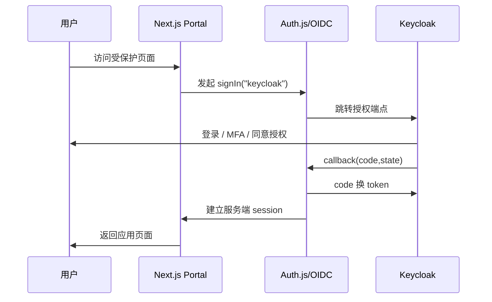

# 03. 身份认证与会话设计

## 1. 目标

本文定义统一用户门户、管理后台和业务应用的认证与会话机制。

核心目标：

- Keycloak 作为唯一身份认证中心。
- Next.js 门户通过 OIDC 接入 Keycloak。
- 各业务应用通过 OIDC 或 SAML 接入 Keycloak。
- 不在业务系统中保存用户密码。
- 所有后端接口必须校验 token 或服务端 session。

## 2. 认证协议选择

默认使用 OIDC Authorization Code Flow。

适用范围：

- Next.js 用户门户。
- 管理后台。
- 普通 Web 业务系统。
- 服务端渲染应用。
- 支持标准 OIDC 的移动端和桌面端。

SAML 仅用于：

- 遗留系统。
- 企业客户强制要求 SAML。
- 已有 SAML IdP 集成场景。

## 3. 登录流程



## 4. Token 类型

| Token | 签发方 | 用途 | 是否暴露给浏览器 |
|---|---|---|---|
| ID Token | Keycloak | 证明用户身份 | 可在受控 session 中使用 |
| Access Token | Keycloak | 访问资源服务器 | 尽量服务端持有 |
| Refresh Token | Keycloak | 刷新 access token | 不直接暴露给前端 JS |
| Session Cookie | Next.js/Auth.js | 门户会话 | HttpOnly、Secure |
| Supabase JWT | Supabase Auth | Supabase RLS 与数据访问 | Supabase 客户端使用 |

## 5. Session 策略

Next.js 门户使用 Auth.js 或等价 OIDC 库维护应用会话。

建议：

- session cookie 使用 `HttpOnly`。
- 生产环境启用 `Secure`。
- SameSite 使用 `Lax` 或按跨站需求调整。
- 管理后台 session 有较短过期时间。
- 高风险操作要求近期认证或二次确认。

## 6. Token 校验规则

服务端必须校验：

```text
iss
aud
exp
nbf
sub
signature
azp/client_id
required roles
```

不要仅在前端解析 token 后信任用户身份或角色。

## 7. 注册流程

注册默认需要管理员审批。注册完成不等于账号立即可用，也不等于用户自动获得业务应用访问权限。

### 7.1 推荐：Keycloak 托管注册

```text
/register
  -> Keycloak registration endpoint
  -> Keycloak 完成密码策略、邮箱验证、MFA 初始化
  -> 回到 Next.js
  -> 平台生成或同步注册申请
  -> 审批通过前用户保持未启用或无应用准入
```

优点：

- 密码不经过 Next.js。
- 安全能力复用 Keycloak。
- 实现成本低。

如果采用 Keycloak 托管注册，必须确保未审批用户不能进入业务应用。可以通过禁用 Keycloak 用户、不给应用准入 Client Role、或两者结合实现。

### 7.2 可选：Next.js 自定义注册表单

适用于强定制注册体验。

要求：

- 表单提交到服务端 Route Handler。
- 服务端先写注册申请，审批通过后再调用 Keycloak Admin API 创建或启用用户。
- 不在 Next.js 存储密码。
- 初始密码必须是临时密码。
- 默认触发邮箱验证。
- 接口必须防刷、防用户枚举。

审批通过后仍需由管理员分配应用准入和应用角色；没有应用准入的用户即使可以登录，也不能进入业务应用。

## 8. 登出流程

登出分两层：

- Next.js 本地 session 清理。
- Keycloak SSO session 清理。

推荐实现：

```text
用户点击退出
  -> 清理 Next.js session
  -> 跳转 Keycloak end_session endpoint
  -> 回到门户首页
```

如果存在 Supabase 应用，还需要由 Supabase 应用清理自己的 Supabase session。

## 9. MFA 流程

MFA 策略在 Keycloak 中配置。

建议：

- 管理员强制 MFA。
- 普通用户按风险策略启用 MFA。
- 高风险操作要求 AAL 或近期登录校验。
- 用户自助 MFA 设置跳转 Keycloak Account Console。

## 10. 用户禁用后的会话处理

用户禁用必须考虑已有会话。

建议：

1. 在 Keycloak 中禁用用户。
2. 调用 Keycloak Admin API 使该用户登出。
3. 发布用户禁用事件。
4. 各业务系统同步本地用户状态。
5. 对高敏系统缩短 access token 有效期。

只有 Keycloak disable 成功，才能认为用户禁用成功。若 Keycloak disable 失败，不允许只更新门户本地镜像状态。

应用准入撤销时，平台准入事实可以立即变为 revoked，但撤销完成必须以 Keycloak Client Role 移除成功为关键完成点。

业务应用接入层必须校验当前应用的 Keycloak Client Role。缺少当前应用准入 Client Role 时，即使用户已经登录 Keycloak，也不能进入该业务应用。

平台准入查询 API 或业务应用本地准入缓存只用于加强拒绝和撤权兜底，不作为绕过 Keycloak Client Role 的放行依据。

即使用户禁用或应用准入撤销完成，已有 access token 仍可能在过期前有效。因此高敏应用必须结合以下措施：

- 缩短 access token TTL。
- 必要时触发 Keycloak 会话登出。
- 业务系统后端校验本地准入投影或消费撤权事件。
- 定期对账平台准入事实与业务系统本地投影。

## 11. 错误处理

注册、找回密码、重置密码避免用户枚举。

统一提示：

```text
如果账号存在，我们会发送后续邮件。
```

登录失败提示避免暴露：

```text
用户名不存在
邮箱未注册
```

## 12. 官方依据

- Auth.js Keycloak Provider 使用 OIDC，并要求 issuer 包含 realm。
- Next.js Route Handlers 需要像公开 API 一样做认证和角色校验。
- Keycloak 暴露标准 OIDC 端点供应用认证和授权。
