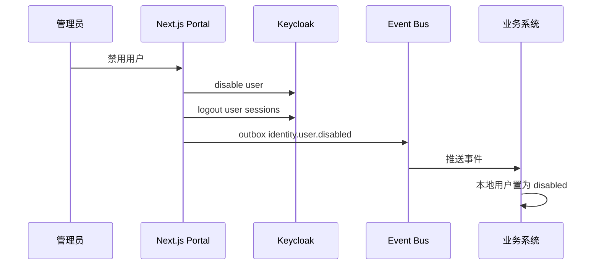

# 08. 同步与事件设计

## 1. 目标

本文定义 Keycloak、Next.js 门户、平台权限中心和各业务系统之间的数据同步机制。

同步目标：

- 用户创建、禁用、删除状态可传播。
- 应用准入变更可传播。
- 应用角色分配变更可传播。
- 用户身份映射保持一致。
- 业务系统可以在本地保留权限投影。
- 出错可重试、可审计、可对账。

## 2. 同步原则

```text
Keycloak 是身份源
统一身份平台数据库是平台授权事实源
业务系统是角色权限定义和业务权限执行源
```

不要要求所有系统实时强一致。

新增授权可以最终一致。撤权类操作必须更严格，关键执行点完成后才能声明完成。

按风险划分一致性：

| 数据 | 一致性要求 |
|---|---|
| 用户禁用 | 高，尽快同步 |
| 用户删除 | 高，需谨慎处理 |
| 应用准入撤销 | 高 |
| 应用角色分配变更 | 中高，按业务要求 |
| 用户资料更新 | 中 |
| 头像、偏好设置 | 低 |
| 业务权限投影 | 中高，按业务要求 |

## 3. 用户创建策略

推荐组合：

```text
惰性创建 + 事件同步 + 定时对账
```

惰性创建：

- 用户首次登录应用时，应用创建本地 `app_users` 映射。
- 通过 `keycloak_sub` 关联全局用户。

事件同步：

- Keycloak 用户创建、禁用、删除事件推送到门户。
- 门户发布内部事件给业务系统。

定时对账：

- 周期性比对 Keycloak 用户状态和本地用户映射。

## 4. 事件类型

用户事件：

```text
identity.user.created
identity.user.updated
identity.user.disabled
identity.user.enabled
identity.user.deleted
identity.user.logout
```

应用准入事件：

```text
access.application.granted
access.application.revoked
access.application.expired
```

应用角色分配事件：

```text
application.role.assigned
application.role.revoked
application.role.updated
```

审计事件：

```text
audit.admin.action_created
```

## 5. 事件结构

命名约定：

```text
数据库字段使用 snake_case
API / MQ / Webhook JSON payload 使用 camelCase
```

`eventId` 是事件幂等键，`traceId` 串联完整异步链路，`operationId` 聚合一次稳定业务操作。

```json
{
  "eventId": "evt_...",
  "eventType": "identity.user.disabled",
  "eventVersion": 1,
  "occurredAt": "2026-06-26T10:00:00Z",
  "traceId": "trace_...",
  "operationId": "op_...",
  "causationId": "aud_...",
  "correlationId": "trace_...",
  "actor": {
    "keycloakSub": "admin-sub",
    "email": "admin@example.com"
  },
  "target": {
    "keycloakSub": "user-sub",
    "email": "user@example.com"
  },
  "data": {},
  "source": "user-portal"
}
```

## 6. 同步通道

目标态采用组合模式：

```text
统一身份平台数据库事件表
  -> RabbitMQ 高可用队列
  -> 后台任务服务 / 回调通知 / 业务适配器
  -> 对账任务
```

职责：

- 数据库事件表是平台事实变更的可靠事件源。
- RabbitMQ Quorum Queue 是常规部署下的平台内部异步分发通道。
- MQ 必须通过 adapter 隔离，以兼容后续国产化/信创 MQ 替换。
- Webhook 是外部业务系统通知通道。
- Connector 用于平台维护的业务应用投影适配。
- Reconciliation Job 是安全兜底和差异修复机制。

Keycloak Admin Event 机制是「尽力而为」的，没有持久化和重试保证。如果事件消费服务宕机，期间的事件会丢失。因此：

- 不能只依赖 Keycloak 事件推送，必须配合定时对账作为最终一致性兜底。
- 用户禁用、删除等关键事件丢失必须告警。
- 用户资料更新等低优先级事件丢失可接受，由对账修复。
- 如果对实时性要求高，可考虑使用 Keycloak Event Listener SPI + 持久化队列。

所有平台事实变更必须在同一个数据库事务中写事实表和 `outbox_events`。

```text
transaction:
  update application_assignments
  insert outbox_events
commit
```

### 6.1 事件数据表

#### outbox_events

```sql
outbox_events
- id
- event_id              -- 事件幂等键，对应 payload 中的 eventId
- event_type
- event_version          -- 事件版本号
- aggregate_type
- aggregate_id
- payload
- status                 -- pending / published / failed
- occurred_at
- published_at
- retry_count
- last_error
- trace_id               -- 串联异步链路
- operation_id           -- 聚合一次业务操作
```

#### webhook_deliveries

```sql
webhook_deliveries
- id
- event_id
- subscriber_id
- status                 -- pending / delivered / failed
- attempt_count
- next_retry_at
- response_status
- last_error
- trace_id               -- 串联异步链路
- operation_id           -- 聚合一次业务操作
```

#### dead_letter_events

```sql
dead_letter_events
- id
- event_id
- event_type
- event_version
- trace_id
- operation_id
- payload
- consumer
- error_message
- retry_count
- created_at
- updated_at
```

#### processed_events

```sql
processed_events
- event_id
- consumer
- trace_id
- operation_id
- processed_at
- UNIQUE (event_id, consumer)
```

`outbox_events`、`webhook_deliveries` 和 `dead_letter_events` 必须同时保存 `trace_id` 和 `operation_id`，用于完整链路追踪。

### 6.2 Webhook 安全验证

Webhook 是外部业务系统通知通道，必须实施签名验证，防止伪造请求。

#### 6.2.1 签名机制

每个业务应用分配独立的 Webhook Secret。平台发送 Webhook 请求时必须携带签名头：

```text
X-Webhook-Signature: sha256=base64(HMAC-SHA256(secret, timestamp + '.' + payload))
X-Webhook-Timestamp: 1719648000
X-Webhook-Event-Id: evt_...
```

`payload` 为原始请求体字符串（raw body），不是解析后的 JSON 对象。这确保签名计算与 JSON 序列化顺序无关，平台和业务应用两端都能独立计算一致的签名。

#### 6.2.2 业务应用端验证

业务应用接收 Webhook 时必须验证：

1. 签名是否正确（使用自己的 Webhook Secret 重新计算 HMAC-SHA256 并比对）。
2. 时间戳是否在 5 分钟内（防重放攻击）。
3. `X-Webhook-Event-Id` 是否已处理过（幂等去重）。

任一校验失败返回 `401 Unauthorized`。

#### 6.2.3 Webhook 投递保障

- 指数退避重试，最多 5 次。
- 重试间隔：1s、5s、30s、2min、10min。
- 所有重试失败后进入死信队列，告警人工处理。
- Webhook 投递状态记录在 `webhook_deliveries` 表中。

#### 6.2.4 连通性测试

平台提供 Webhook 连通性测试工具：

- 业务应用接入时可以发送测试事件验证签名和连通性。
- 提供签名验证的示例代码。

## 7. 用户禁用流程



只有 Keycloak disable 成功，才能认为用户已禁用。如果 Keycloak disable 成功但本地镜像或事件发布失败，平台必须标记同步失败并进入重试和对账。

## 8. 应用准入同步

准入授权：

```text
写 application_assignments
设置 projection_status = pending
同步 Keycloak Client Role
发布 access.application.granted
业务系统更新本地准入缓存
```

平台准入事实写入成功即成立。Keycloak 或业务应用投影失败时，不回滚 `application_assignments`，而是进入重试、告警和对账。

准入撤销：

```text
application_assignments.status = revoked
projection_status = pending
移除 Keycloak Client Role
发布 access.application.revoked
业务系统禁用本地访问
```

撤销完成必须以 Keycloak Client Role 移除成功为关键完成点。业务应用投影失败必须告警、重试和对账。

### 8.0 应用目录 → Keycloak 准入角色 reconcile

应用目录（`config/business-apps.yaml`）apply 到统一身份平台数据库提交后，由 `catalog-reconcile-service` 对每个 `active` 应用执行 Keycloak 准入角色（`accessRole`）reconcile：仅在已存在的 Keycloak Client 上 ensure 该 client role，不创建 Client，也不为业务角色建 Keycloak 角色。Reconcile 按应用逐一隔离执行，单个应用失败或对应 Client 缺失不阻断其它应用，失败计入报告而非抛出致命错误。业务角色分配的投影渠道不变，仍按 §8.1 经 Webhook 交付给业务应用。

## 8.1 应用角色分配同步

角色分配：

```text
写 application_user_roles
设置 projection_status = pending
发布 application.role.assigned
业务系统更新本地角色分配投影
```

角色撤销：

```text
application_user_roles.status = revoked
设置 projection_status = pending
发布 application.role.revoked
业务系统移除本地角色分配投影
```

说明：

- 平台权限中心是“用户在某个应用中是什么角色”的事实源。
- 业务应用是“该角色具体拥有哪些权限”的定义和执行源。
- 角色分配投影失败时进入重试、告警和对账。
- 高风险业务系统可以在运行时结合本地角色分配投影和定期对账，降低延迟或投影失败风险。

## 9. 重试与死信

事件消费失败：

```text
重试 3 次
指数退避
进入 dead_letter_events
告警
人工处理
```

死信表结构见 §6.1。

MQ 投递语义为 at-least-once。所有消费者必须按 JSON payload 中的 `eventId` 幂等；在数据库表中对应字段为 `event_id`。

## 10. 对账任务

定期对账：

- Keycloak 用户状态 vs 门户用户状态。
- 门户应用准入 vs Keycloak Client Role。
- 平台权限中心授权 vs 业务系统本地准入投影。
- 平台应用角色分配 vs 业务系统本地角色分配投影。
- 统一身份平台数据库事实状态 vs 业务应用 connector/webhook 投影状态。

频率：

```text
高风险：每小时
普通资料：每日
全量审计：每周
```

## 11. 幂等性

消费者必须按 JSON payload 中的 `eventId` 幂等。在数据库表中，该幂等键保存为 `event_id`。`processed_events` 表结构见 §6.1。

重复事件不能导致重复授权或重复写入。

## 11.1 事件版本演进策略

事件 payload 包含 `eventVersion` 字段，用于 MQ、Webhook 和 connector 契约演进。

### 11.1.1 版本号规则

采用语义化版本思路：`{major}.{minor}`

- `major`：不兼容变更（字段删除、字段类型变更、语义变更）。
- `minor`：向前兼容变更（新增可选字段）。

当前事件 payload 中的 `eventVersion` 为整数，对应 major 版本。minor 版本通过新增可选字段隐式演进，不改变 `eventVersion` 值。如果未来需要表达更细粒度的版本（如 breaking patch），可以扩展为字符串格式（如 `"1.2"`）。

### 11.1.2 消费者容忍规则

- 消费者必须忽略未知字段（向前兼容）。
- 遇到不认识的 major 版本，直接进入死信并告警，不尝试处理。
- 消费者必须记录自己支持的事件 major 版本范围。

### 11.1.3 升级策略

主版本升级时：

1. 平台同时发布 v1 和 v2 事件（双发），`outbox_events` 表增加 `event_version` 字段标记版本。
2. 给消费者 2-4 周的迁移窗口。
3. 旧版本事件在确认所有消费者都迁移后停止发布。
4. 升级期间通过 `dead_letter_events` 表保留 `event_version`，便于排查兼容性问题。

### 11.1.4 数据库设计

`outbox_events` 表和 `dead_letter_events` 表都必须保留 `event_version` 字段。

## 12. 可观测性

指标：

```text
事件积压量
消费成功率
消费失败率
平均延迟
死信数量
对账差异数量
```

告警：

- 用户禁用事件超过阈值未消费。
- 死信数量增长。
- 对账发现高风险差异。
- Keycloak Admin Event 中断。
- RabbitMQ 队列积压或 DLQ 增长。
- Webhook 投递失败持续增长。
