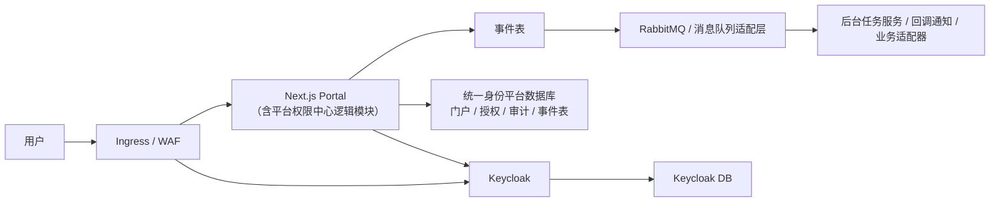

# 10. 部署与运维设计

## 1. 目标

本文定义 Keycloak、Next.js 门户、数据库、同步服务和监控运维方案。

## 2. 部署拓扑

平台权限中心是 Next.js 门户内的服务端逻辑模块（`server/services` + `server/repositories` + `server/policies`）。统一身份平台数据库保存门户数据、平台授权数据、审计日志和事件表，这些数据可以共用同一数据库集群，但必须逻辑隔离（独立 schema 或独立 database 账号）。



部署单元说明：

| 部署单元 | 说明 |
|---|---|
| Next.js Portal | 单一部署单元，包含门户 UI、服务端管理接口、平台权限中心逻辑模块和后台任务 |
| Keycloak | 独立 Docker 容器，多副本高可用 |
| 统一身份平台数据库 | PostgreSQL/KingbaseES，包含门户数据、平台授权数据、审计日志和事件表等逻辑 schema |
| Keycloak DB | 独立 database，与统一身份平台数据库逻辑隔离 |
| RabbitMQ | 独立 Docker 容器，通过消息队列适配层隔离 |
| Redis | 独立 Docker 容器，用于 BullMQ 任务队列和速率限制 |
| Worker | 可选独立 Docker 容器。从 Next.js Portal 拆分。当后台任务负载导致 Next.js Portal 实例资源紧张时，或需要单独扩缩容时，将 Worker 拆分为单独容器运行 |

## 3. 环境划分

```text
dev
staging
prod
```

每个环境独立：

- Keycloak realm 或实例。
- Client secret。
- 数据库。
- Redirect URI。
- 邮件配置。
- 外部回调地址。

## 4. Keycloak 部署

建议：

- 容器化部署。
- 多副本高可用。
- 外置数据库。
- 开启健康检查。
- 配置反向代理头。
- 配置 HTTPS。
- 定期备份 realm 配置和数据库。

## 5. Next.js 部署

建议：

- Node.js runtime。
- 容器化部署。
- 多副本。
- 无状态服务。
- session secret 所有副本一致。
- 管理 API 只通过服务端调用外部系统。

## 6. 数据库与缓存

数据库和缓存分类：

```text
Keycloak DB
统一身份平台数据库（门户数据 / 平台授权数据 / 审计日志 / 事件表）
Redis（BullMQ 任务队列 + 速率限制）
业务系统 DB
```

要求：

- 统一身份平台数据库默认使用 PostgreSQL，可以共用同一数据库集群承载门户数据、平台授权数据、审计日志和事件表，但必须逻辑隔离（独立 schema 或独立 database 账号）。
- 统一身份平台数据库的 schema、migration 和查询必须兼容 KingbaseES PostgreSQL 兼容模式。
- Keycloak DB 按 Keycloak 部署要求单独决定。
- Keycloak DB 可以与统一身份平台数据库共用同一数据库集群，但必须逻辑隔离。
- 推荐 Keycloak DB 使用独立 database、独立 schema owner、独立数据库账号、独立连接池和独立备份恢复策略。
- 平台 migration 不管理 Keycloak 内部 schema，平台服务不得直接读写 Keycloak DB。
- KingbaseES 兼容要求只适用于统一身份平台数据库。Keycloak DB 是否使用 KingbaseES 必须以 Keycloak 实际支持和 POC 验证为准。
- Redis 用于 BullMQ 任务队列调度和速率限制计数，不存储持久化业务数据。Redis 重启后 BullMQ 任务状态和速率限制计数会丢失：任务由对账兜底重新触发，速率限制计数重置后短期内可能多允许几次请求，影响可接受。如果任务量较大或对任务丢失零容忍，建议启用 Redis AOF 持久化。
- Redis 必须启用密码认证。生产环境不得向宿主机公网发布 Redis 端口；开发环境如需宿主机访问，只允许绑定 `127.0.0.1:16379`。
- 业务系统 DB 自治。
- 生产备份。
- 定期恢复演练。
- 权限最小化。
- 数据库连接池。
- 慢查询监控。

## 6.1 MQ 与同步服务

常规部署优先 RabbitMQ Quorum Queue。

MQ 必须通过 adapter 隔离具体产品，便于后续替换为客户或组织信创清单中的国产 MQ。

同步服务包括：

- 事件表派发任务。
- Keycloak projection worker。
- Webhook delivery worker。
- 业务应用 connector。
- Reconciliation job。
- Dead letter retry job。

## 7. 配置管理

配置来源：

- 环境变量。
- Secret Manager。
- 配置中心。

禁止：

- secret 写入代码。
- secret 写入前端 bundle。
- 多环境共用 secret。

## 8. 健康检查

Next.js：

```text
GET /api/health
```

检查：

- 应用存活。
- 数据库连接。
- Keycloak OIDC discovery 可访问。
- 权限中心可访问。
- RabbitMQ/MQ adapter 可访问。
- outbox dispatcher 状态正常。

Keycloak：

- 使用官方健康检查端点或容器健康检查。
- 监控数据库连接。

## 9. 日志

日志类型：

- 应用日志。
- 访问日志。
- 审计日志。
- Keycloak 登录事件。
- Keycloak Admin 事件。
- 同步事件日志。

要求：

- 包含 requestId、traceId 和 operationId。
- 不记录 token。
- 不记录密码。
- 不记录 secret。

## 10. 监控指标

门户：

```text
请求量
错误率
P95/P99 延迟
登录成功率
管理 API 成功率
Keycloak Admin API 调用失败率
```

Keycloak：

```text
登录失败率
token 请求量
Admin API 错误率
数据库连接数
JVM/容器资源
```

同步：

```text
事件积压量
消费延迟
死信数量
对账差异数
RabbitMQ 队列积压
Webhook 投递失败率
```

## 11. 告警

必须告警：

- Keycloak 不可用。
- 登录失败率异常。
- Admin API 错误率异常。
- 用户禁用事件消费失败。
- 死信队列增长。
- RabbitMQ 队列积压异常。
- Webhook 投递失败持续增长。
- 应用准入撤销投影失败。
- 数据库连接异常。
- 证书即将过期。
- secret 轮换失败。

## 12. 备份恢复

备份对象：

- Keycloak DB。
- Keycloak realm 配置导出。
- 统一身份平台数据库（门户数据 / 平台授权数据 / 审计日志 / 事件表）。
- MQ 配置和队列声明。
- Redis 持久化配置（如有）。

恢复要求：

- 定期恢复演练。
- 记录 RPO/RTO。
- 生产变更前可回滚。
- Keycloak DB 与统一身份平台数据库即使共用数据库集群，也必须分别验证备份恢复。
- Keycloak 升级前必须备份 Keycloak DB 和 realm 配置导出。

## 13. 发布策略

建议：

- dev 验证。
- staging 集成测试。
- prod 灰度。
- 管理后台变更低峰发布。
- Keycloak 配置变更必须有回滚方案。

## 14. 密钥轮换

轮换对象：

- Keycloak client secret。
- Auth.js secret。
- 数据库密码。
- 内部 API key。
- 业务应用 service key，例如 Supabase service role key。

要求：

- 有双 secret 过渡或短暂停机窗口。
- 轮换后验证登录和 Admin API。
- 记录轮换审计。

## 15. 运维手册

需要单独沉淀 runbook：

```text
Keycloak 不可用
登录异常
用户无法登录
管理员误禁用用户
Admin token 泄漏
同步事件堆积
应用准入撤销投影失败
RabbitMQ 不可用
Webhook 投递失败
数据库连接耗尽
证书过期
```
